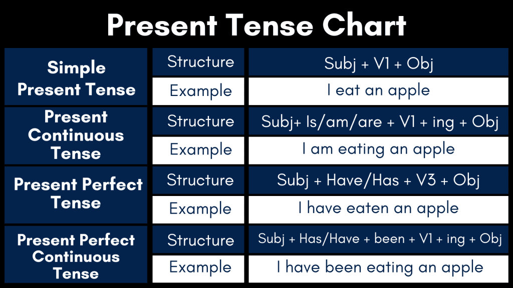

# Tenses

I ate an apple ( Verb phrase – ate – Simple Past )
I was eating an apple ( Verb phrase – was eating – Past Continuous )
I had eaten an apple ( Verb phrase – had eaten – Past Perfect )
I had been eating an apple ( Verb phrase – had been eating – Past Perfect Continuous )

I eat an apple ( Verb phrase – eat – Simple Present )
I am eating an apple ( Verb phrase – am eating – Present Continuous )
I have eaten an apple ( Verb phrase – have eaten – Present Perfect )
I have been eating an apple ( Verb phrase – have been eating – Present Perfect Continuous )

I shall eat an apple ( Verb phrase – shall eat – Simple Future )
I shall be eating an apple ( Verb phrase – shall be eating – Future Continuous )
I shall have eaten an apple ( Verb phrase – shall have eaten – Future Perfect )
I shall have been eating an apple ( Verb phrase – shall have been eating – Future Perfect Continuous)